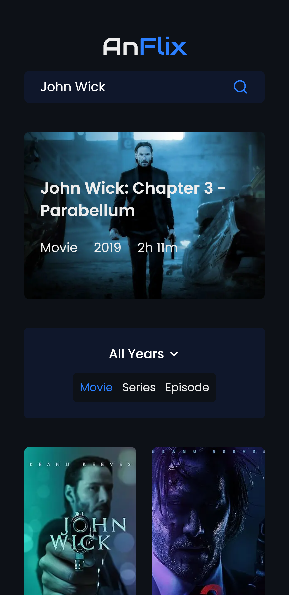

# 🎬 AnFlix – IMDb Clone Using OMDb API

AnFlix is a responsive and modern movie database web app inspired by **IMDb**. This app allows users to **search for movies** and explore various titles using the [OMDb API](http://www.omdbapi.com/).

---

## 🚀 Features

- 🔍 Search movies by title using OMDb API
- 📄 View detailed movie info: Title, Year, Poster, Category
- 🖼️ Skeleton Loading UI for smoother experience
- 📱 Fully responsive layout (mobile, tablet, desktop)
- ❌ Graceful handling for missing images or data

---

## 🛠️ Tech Stack

- **Frontend**: React + Tailwind CSS
- **API**: [OMDb API](http://www.omdbapi.com/)
- **State Management**: React Hooks
- **HTTP Requests**: Fetch
- **Deployment**: Vercel

---

## 📦 Installation

```bash
# Clone the repository
git clone https://github.com/anggasaputra25/anflix.git
cd anflix

# Install dependencies
npm install

# Run the app
npm run dev
```

---

## 🌐 Environment Variables

Create a `.env.local` file in the root directory:

```
NEXT_PUBLIC_OMDB_API_KEY=your_api_key_here
```

Get your free API key at [http://www.omdbapi.com/apikey.aspx](http://www.omdbapi.com/apikey.aspx)

---

## 📸 Screenshots

> Mobile & Desktop View:

| Mobile View | Desktop View |
|-------------|--------------|
|  |  |

---

## 📁 Folder Structure

```
anflix/
├── components/       # Reusable UI components
├── app/              # Homepage
├── public/           # Images
├── types/            # TypeScript interfaces and type definitions
├── .env.local        # Environment variables (paste your api key here)
└── ...
```

---

## 🔒 Notes & Limitations

- Free OMDb API key has request limits (1,000/day)
- Some movies might not have posters
- Frontend-only (no backend, no auth)

---

## 📌 To-Do / Improvements

- 🔖 Add watchlist feature
- 🌐 Multi-language support

---

## 🙌 Credits

- [OMDb API](http://www.omdbapi.com/)
- [React](https://reactjs.org/)
- [Tailwind CSS](https://tailwindcss.com/)
- Made with ❤️ by Angga
- ☕️ Like this project? Feel free to [buy me a coffee](https://lynk.id/payme/justangga)!

---

## 📄 License

This project is licensed under the MIT License.